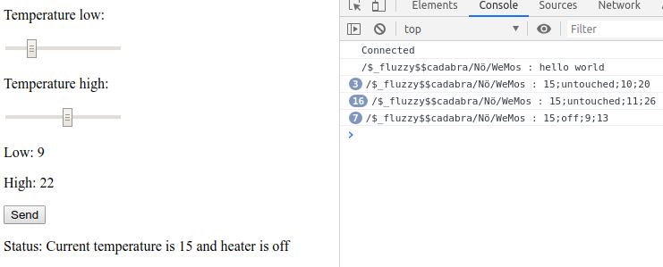

Publishing der Heizungslimits mittels Javascript
=================================================

Grundlagen
-----------

Als Publisher für die Heizungslimits wurde eine Website mittels Javascript und
HTML5 erstellt.

Als MQTT-Implementierung wurde Eclipse Paho für verwendet. Dieses wird über
https://cdnjs.cloudflare.com/ajax/libs/paho-mqtt/1.0.1/mqttws31.js
bereitgestellt. Man bindet die Implementierung im HTML mittels eines
``script``-Tags ein. Als zweites Script wurde im HTML das ``ui.js`` importiert,
welches die Werte published sowie den Werten subscriped, welches das WEMOS Modul
sendet.

HTML
-----

Als Benutzeroberfläche wurde eine sehr einfache Website erzeugt. Diese Website
enthält zwei Regler, mit welchen die mindest und maximal Temperatur gesetzt
werden kann. Außerdem gibt es einen Button, der das Senden der Werte ermöglicht,
und eine Fläche, um die Informationen über den Zustand der Heizung, welche vom
WEMOS Modul übertragen werden, darzustellen.

Auf der Oberfläche ist es möglich, den maximal Wert niedriger als den minimal
Wert zu setzen, beim Absenden der Werte wird aber eine Fehlermeldung angezeigt
und die Werte nicht gesendet.

.. literalinclude:: ../webpage/index.html
    :language: HTML

Nachfolgenden sieht man ein Screenshot, wie die Website im Betrieb aussieht.

    Website sendet und empfängt Daten vom Broker

Javascript
------------

Als Broker wurder ``test.mosquitto.org`` verwendet. Es konnte aber nicht der
unverschlüsselte Port 1883 benutzt werden, sondern der für WebSockets
vorbereitete verschlüsselte Port 8081.

Es gibt Funktionen, um sich mit dem Broker zu verbinden und im Fall des
Verbindungsverlust eine neue Verbindung aufzubauen. Außerdem gibt es Funktionen,
um die Werte bevor sie an den Broker gesendet werden aufzubereitet, sowie eine
Funktion, um auf eingehende Nachrichten vom WEMOS zu reagieren und im HTML
anzuzeigen.

In der Funktion ``send()`` wird zudem überprüft, ob der maximal Wert niedriger
als der minimal Wert ist und dem entsprechend eine Fehlermeldung ausgegeben. Die
Werte werden an den Broker im Format ``low;high`` übertragen. Einstellige
Temperaturen werden mit führenden Nullen aufgefüllt.

Eingehende Nachrichten vom WEMOS werden in Temperatur und Zustand der Heizung
gesplitted und im HTML angezeigt. Da das WEMOS Modul den Zustand der Heizung mit
``on``, ``off`` und ``untouched`` überträgt, können die Werte direkt in den
String, welcher im HTML angezeigt wird eingebaut werden.

.. literalinclude:: ../webpage/ui.js
    :language: Javascript
