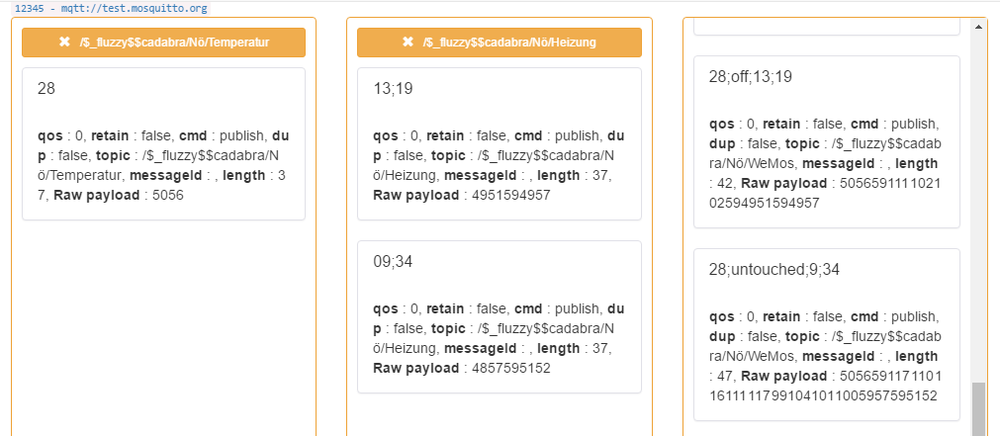

Wemos
======

Voraussetzungen
---------------

Die Hardware besteht aus einem **IZOKEE ES8266 WIFI Modul**. Per MicroUSB 
ist das Modul mit einem Notebook verbunden worden. Zusätzlich wurde ein WLAN
in Form eines Hotspots erstellt, welches im Rahmen des Projekts als 
Kommunikationsweg mit einem MQTT-Broker dient.

Programmiert wurde mittels einer Arduino-Oberfläche in der Sprache C. Die 
Testumgebung bestand aus einer MQTTBox. 

Vorlage
-------

Als Vorlage der umgesetzen Projektarbeit dient das bereits in der Vorlesung 
besprochene "WeMosMQTTSubPub_Projekt5". Einzelne Codeabschnitte konnten 
hierfür verwendet werden und mussten nicht mehr selbst implementiert werden.

Implementierung
---------------

Konfiguration Connection
^^^^^^^^^^^^^^^^^^^^^^^^

WLAN Konfiguration

.. code-block:: bash

    const char* ssid = "SSID";
    const char* password = "PASSWORD";

MQTT Konfiguration

.. code-block:: bash

    const char* mqtt_server = "test.mosquitto.org";   
    const char* topic0 = "/$_fluzzy$$cadabra/Nö/Heizung";
    const char* topic1 = "/$_fluzzy$$cadabra/Nö/Temperatur";
    const char* topic2 = "/$_fluzzy$$cadabra/Nö/WeMos";
    String clientId = "WeMos_";
    char* clientID_c_str = "1234567890123456789012345678";

Startwerte definieren
^^^^^^^^^^^^^^^^^^^^^^

.. code-block:: bash

    //actual temperature
    int temp = 15;
      
    //temperature limits
    int bottomLimit = 10;
    int upperLimit = 20;

Callback Function
^^^^^^^^^^^^^^^^^^

Konvertierung der Grenzen der Heizung (Input der Webanwendung)

.. code-block:: bash

    if(strcmp(topic, "/$_fluzzy$$cadabra/Nö/Heizung") == 0) {
        bottomLimit = 10*(payload[0]-'0') + (payload[1]-'0');  
        upperLimit = 10*(payload[3]-'0') + (payload[4]-'0');
    }

Konvertierung der aktuellen Temperatur (Input der Pythonanwendung)

.. code-block:: bash

    if(strcmp(topic, "/$_fluzzy$$cadabra/Nö/Temperatur") == 0) {
        for (int i = 0; i < length; i++) {

            if(payload[0] != '-'){                //negativ values
                if(i==0 && length > 1){           //double digit
                    temp = 10*(payload[i]-'0');
                }
                else if (i==0){                   //single digit
                    temp = (payload[i]-'0');
                }
                else{
                    temp = temp + payload[i]-'0';
                }        
            }
            else{                                 //positive values
                if(i==1 && length > 2){           //double digit
                    temp = 10*(payload[i]-'0');
                }
                else if (i==1){                   //single digit
                    temp = (payload[i]-'0');
                }
                else{
                    temp = temp + payload[i]-'0';
                } 
            }
        }
        if(payload[0] == '-'){                    //add minus in front of negativ value
            temp = -temp;
        }
    }

Verbindungsaufbau
^^^^^^^^^^^^^^^^^^

Anbindung an die richtigen Subscriber und Publisher

.. code-block:: bash

    client.publish(topic2, "hello world");
    client.subscribe(topic0);
    client.subscribe(topic1);

Abfrageroutine
^^^^^^^^^^^^^^

Auswertung der aktuellen Temperatur alle 5 Sekunden

.. code-block:: bash

    if (temp < bottomLimit) {
        snprintf (msg, 20, "%ld;on;%ld;%ld",temp,bottomLimit,upperLimit);
      }
      else if (temp > upperLimit){
        snprintf (msg, 20, "%ld;off;%ld;%ld",temp,bottomLimit,upperLimit);
      }
      else {
        snprintf (msg, 20, "%ld;untouched;%ld;%ld",temp,bottomLimit,upperLimit);
      }
      
      client.publish(topic2, msg);

Testing
-------
Nachfolgend ist ein Versuchsaufbau in MQTTBOX dargestellt, der die Kommunikation
der einzelnen Komponenten (Website, Pythonanwendung und Wemos-Modul) aufzeigt.

    MQTT Connection

    MQTT Subscriber Übersicht

    MQTT Abfrage Beispiel